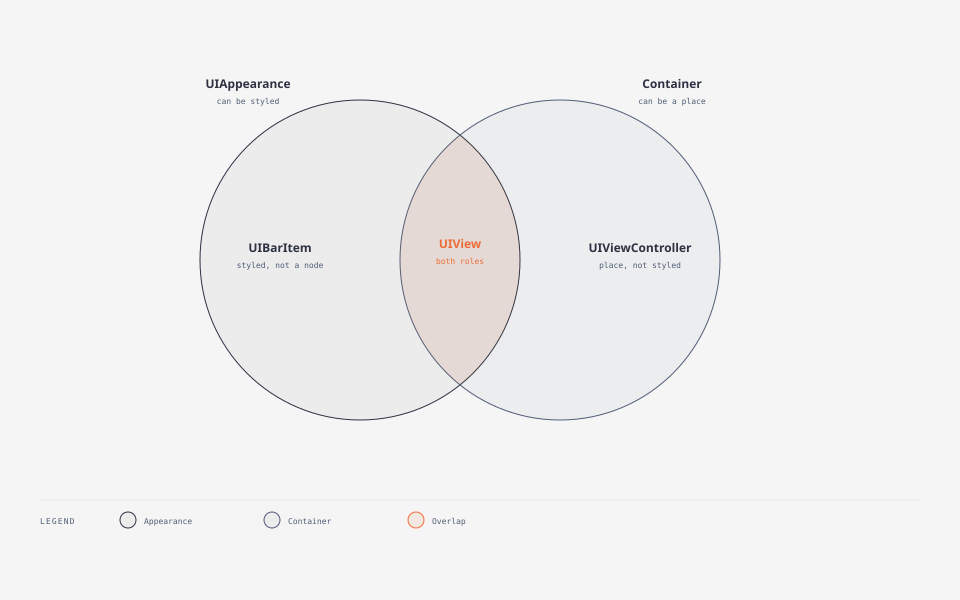

# UIKit Appearance

本目录整理 `UIAppearance` / appearance proxy。

| 文档 | 说明 |
|------|------|
| [UIAppearance 与 appearance proxy](./UIAppearance.md) | 定义、与 Container 的关系、设计思想、作用范围、子类继承、匹配规则、生效时机 |
| [_UIAppearance：接口与按接口实现](./_UIAppearance.md) | RuntimeBrowser 导出的私有接口、推断、按接口自己接的一版 |

### 工程图

