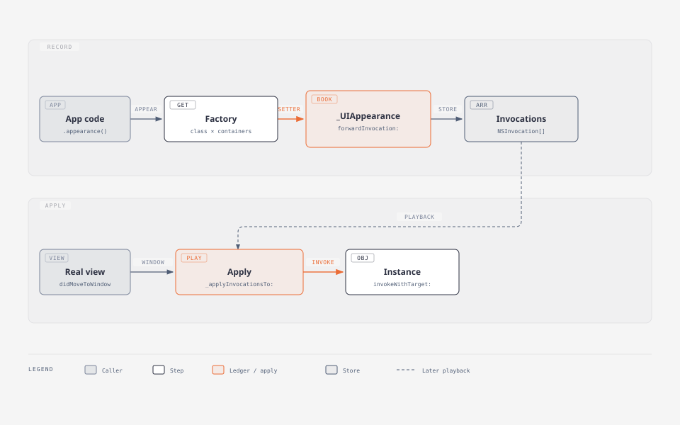
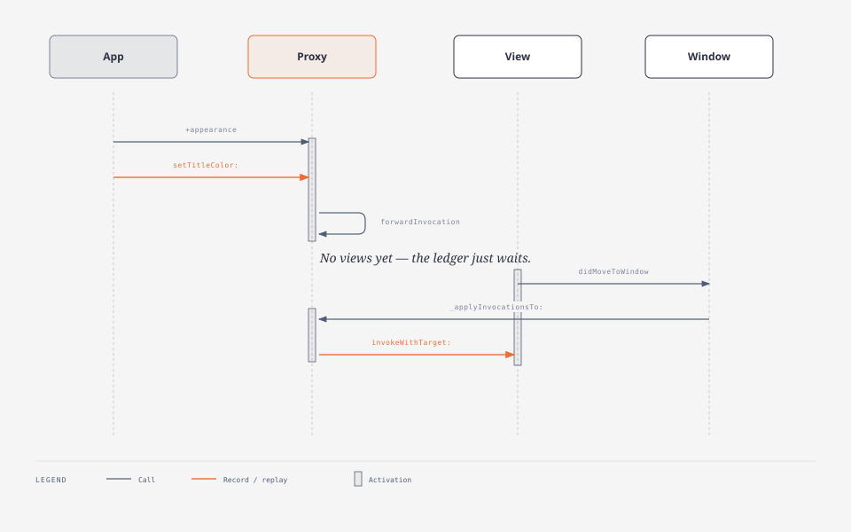

# `_UIAppearance`：接口与按接口实现

> 私有类。头文件来自 RuntimeBrowser 从 UIKit 二进制导出，**没有 `.m`**。  
> 实现一节是按接口自己接的一版，不是反编译 Apple。  
> 公开用法见 [UIAppearance 与 appearance proxy](./UIAppearance.md)。

---

## 接口（RuntimeBrowser 导出）

```objc
/* Generated by RuntimeBrowser
   Image: /System/Library/Frameworks/UIKit.framework/UIKit
 */

@class NSArray, NSMapTable, NSMutableArray, NSMutableDictionary;

@interface _UIAppearance : NSObject {
    Class _CustomizableClass;
    NSMutableArray *_appearanceInvocations;
    NSArray *_containerList;
    NSMapTable *_invocationSources;
    NSMutableDictionary *_resettableInvocations;
}

@property(readonly) Class _CustomizableClass;
@property(setter=_setResettableInvocations:,retain) NSMutableDictionary * _resettableInvocations;

+ (void)_addWindow:(id)arg1 forSource:(id)arg2;
+ (id)_appearanceForClass:(Class)arg1 withContainerList:(id)arg2;
+ (void)_applyInvocationsTo:(id)arg1 window:(id)arg2 matchingSelector:(SEL)arg3;
+ (void)_applyInvocationsTo:(id)arg1 window:(id)arg2;
+ (id)_currentAppearanceSource;
+ (BOOL)_hasCustomizationsForClass:(Class)arg1;
+ (id)_pendingRecordInvocationsForSource:(id)arg1;
+ (id)_recorderForSource:(id)arg1;
+ (id)_recordersExcludingSource:(id)arg1 withWindow:(id)arg2;
+ (void)_removeWindow:(id)arg1 forSource:(id)arg2;
+ (id)_rootAppearancesNode;
+ (void)_setCurrentAppearanceSource:(id)arg1;
+ (void)_setInvalidatesViewsOnAppearanceChange:(BOOL)arg1;
+ (id)_windowsForSource:(id)arg1;

- (Class)_CustomizableClass;
- (id)_appearanceInvocations;
- (id)_resettableInvocations;
- (id)_resettableInvocationsCreateIfNecessary;
- (void)_setResettableInvocations:(id)arg1;
- (void)dealloc;
- (void)forwardInvocation:(id)arg1;
- (id)methodSignatureForSelector:(SEL)arg1;
- (void)updateResettableSelectorsWithInvocation:(id)arg1 removeSelector:(BOOL)arg2;

@end
```

来源：[`nst/iOS-Runtime-Headers` `_UIAppearance.h`](https://github.com/nst/iOS-Runtime-Headers/blob/2d1452d163050ef211efed237de1ea132823fc8c/Frameworks/UIKit.framework/_UIAppearance.h)

---

## 接口在干什么

一个 `_UIAppearance` 实例 = 「某个类 + 某条容器链」的记账本。公开的 `+appearance` / `+appearanceWhenContainedInInstancesOfClasses:` 只是下面工厂的薄封装。

**整本账是运行时对象，不是编译产物。** `forwardInvocation:`、`NSInvocation`、进 window 才 `_applyInvocationsTo:`，都是进程跑起来之后才发生。编译期只有 `UI_APPEARANCE_SELECTOR` / `@objc dynamic` 这种打标，好让 setter 能被 ObjC 运行时看见。

### 成员

| 成员 | 作用 |
|------|------|
| `_CustomizableClass` | 这本账给哪个类记（`UIButton` / `UISlider` …） |
| `_containerList` | `whenContainedInInstancesOf:` 那串类型；`appearance()` 就是空列表 |
| `_appearanceInvocations` | 记下来的 `NSInvocation` 数组（方法名 + 参数） |
| `_invocationSources` | 每条调用从哪来（代理回放 vs 实例自己设） |
| `_resettableInvocations` | 换规则时要先清掉的旧 setter |

### 方法三摊

**拿替身**

| 方法 | 作用 |
|------|------|
| `+_appearanceForClass:withContainerList:` | 工厂：按「类 × 容器链」找到或创建一本账 |
| `+_rootAppearancesNode` | 总账本树，避免每次 new 代理 |
| `+_hasCustomizationsForClass:` | 快路径：这类从没配过就跳过回放 |

**记账**

| 方法 | 作用 |
|------|------|
| `methodSignatureForSelector:` | 替身没有真实 setter，去 `_CustomizableClass` 问签名 |
| `forwardInvocation:` | 把这次调用打成 `NSInvocation` 放进 `_appearanceInvocations` |
| `updateResettableSelectorsWithInvocation:removeSelector:` | 同时维护可回滚列表 |

**回放**

| 方法 | 作用 |
|------|------|
| `+_applyInvocationsTo:window:` | 视图进 window 时，按真实容器链回放 |
| `+_applyInvocationsTo:window:matchingSelector:` | 只回放某一个 setter |

**Source / Recorder / Window**

| 方法 | 作用 |
|------|------|
| `+_currentAppearanceSource` / `+_setCurrentAppearanceSource:` | 回放时标明「现在是代理在设」，好和实例自己设的分开 |
| `+_recorderForSource:` / `+_pendingRecordInvocationsForSource:` / `+_recordersExcludingSource:withWindow:` | 按来源收记账本 |
| `+_addWindow:forSource:` / `+_removeWindow:forSource:` / `+_windowsForSource:` | window 和 source 绑在一起，多窗口不串账 |
| `+_setInvalidatesViewsOnAppearanceChange:` | 改规则后要不要刷新已在 window 里的视图；默认应关 |

头文件**不能**证明匹配算法细节（外层优先怎么比、子类怎么爬）。那部分以 [WWDC 2011 Session 114](https://developer.apple.com/videos/play/wwdc2011/114/) 和公开 `UIAppearance` 文档为准。

### 工程图

Markdown 预览里直接看图。完整带标题的一页仍可打开 HTML。





```
UIButton.appearance(whenContainedIn: [Nav.self]).setTitleColor(.red, …)
        │
        ▼
+_appearanceForClass:UIButton containerList:[Nav]
        │  找到或创建一本账
        ▼
forwardInvocation:  →  _appearanceInvocations += setTitleColor:
        │
        … 之后某个 UIButton 进入 window …
        ▼
+_applyInvocationsTo:button window:
        │  沿 window 读真实层级，匹配 containerList
        │  查 _invocationSources：实例已经 setTitleColor 过则跳过
        ▼
invokeWithTarget:button
```

---

## 若按这套接口实现

按头文件自己写一版的接法，不是反编译 Apple。公开文档的匹配规则补上头文件里没有的部分。

### 总账本

```objc
// +_rootAppearancesNode
// key: Class → (key: containerList → _UIAppearance)
static NSMapTable<Class, NSMutableDictionary<NSArray<Class> *, _UIAppearance *> *> *root;
static _Thread_local id currentAppearanceSource;   // +_currentAppearanceSource
static BOOL invalidatesOnChange;                   // 默认 NO
static NSMapTable *windowsBySource;                // +_addWindow:forSource:
```

`+_appearanceForClass:withContainerList:`：查表，没有就 `alloc`，填 `_CustomizableClass`、拷贝 `_containerList`。  
公开的 `+[UIButton appearance]` = 这个方法 + 空数组；`whenContainedIn:` = 带那串 Class。

### 记账（替身本身没有 setter）

```objc
- (NSMethodSignature *)methodSignatureForSelector:(SEL)sel {
    return [_CustomizableClass instanceMethodSignatureForSelector:sel];
}

- (void)forwardInvocation:(NSInvocation *)inv {
    [inv setTarget:nil];
    [inv retainArguments];
    // 同一 setter（含 forState: 这种轴）只留最后一次
    [self replaceInvocationMatching:inv];
    [self updateResettableSelectorsWithInvocation:inv removeSelector:NO];
    if (invalidatesOnChange) {
        // 遍历 windowsBySource，对已在 window 里的视图再 apply 一遍
    }
}
```

`+_hasCustomizationsForClass:`：从该类爬到 `UIView`，root 里有一本账就 YES——apply 时的快路径。

### 进 window 时回放

挂在 `didMoveToWindow`（window 从 nil → 非 nil）：

```objc
+ (void)_applyInvocationsTo:(id)view window:(UIWindow *)window {
    if (window == nil) return;
    if (![self _hasCustomizationsForClass:[view class]]) return;

    NSArray *chain = [self actualContainersFromWindowDown:window to:view];
    // 从父类到子类：先套 UIView 的账，再套 UIButton 的，后者覆盖前者
    for (Class cls in [self classChainRootToLeaf:[view class]]) {
        NSArray<_UIAppearance *> *books = [self appearancesForClass:cls];
        _UIAppearance *winner = [self bestMatch:books inHierarchy:chain];
        if (!winner) continue;

        id previous = [self _currentAppearanceSource];
        [self _setCurrentAppearanceSource:winner];
        for (NSInvocation *inv in winner->_appearanceInvocations) {
            if (matchingSelector && inv.selector != matchingSelector) continue;
            if ([view hasUserCustomizationFor:inv.selector]) continue; // 实例压过规则
            [inv invokeWithTarget:view];
        }
        [self _setCurrentAppearanceSource:previous];
    }
}
```

`matchingSelector:` 那个重载：只回放一个 setter（属性第一次被碰、或 invalidates 时增量更新）。

**容器匹配（公开文档，头文件里没有）：** `_containerList` 必须是真实链上的子序列（从内到外）。候选里：外层那个容器更靠 window 的赢；外层相同则 `_containerList` 更长的赢。

### 实例为什么能压过规则

回放前把 `currentAppearanceSource` 设成这本账。  
每个 `UI_APPEARANCE_SELECTOR` setter 里（或统一 swizzle）：

```objc
if ([_UIAppearance _currentAppearanceSource] == nil) {
    // 业务代码在设 → 记下 selector，以后 apply 跳过
    [self markUserCustomization:sel];
}
```

`_invocationSources`：invocation → source 的 NSMapTable，用来回答「这条账是谁写下的」。多 window 时用 `+_windowsForSource:` 决定这本账要不要打到这个 window。

### 换容器时先擦旧值

视图从 Toolbar 挪到 NavBar，旧 `tintColor` 不能留着。  
`updateResettableSelectorsWithInvocation:removeSelector:` 维护 `_resettableInvocations`：每个 selector 对应一条「回到默认」的 invocation。apply 前先对**不再匹配**的账本跑 reset，再跑 winner。

### 和头文件的对应

| 接口 | 放哪 |
|------|------|
| `+_appearanceForClass:withContainerList:` | 总账本工厂 |
| `forwardInvocation:` / `methodSignatureForSelector:` | 记 `_appearanceInvocations` |
| `+_applyInvocationsTo:window:` | `didMoveToWindow` 回放 |
| `+_currentAppearanceSource` | 区分「代理在设」还是「实例在设」 |
| `+_addWindow:forSource:` | 多窗口隔离 |
| `+_setInvalidatesViewsOnAppearanceChange:` | 默认关，和公开文档一致 |
| `_resettableInvocations` | 换 containment 时回滚 |

不会去做的：在 Swift 里重写这套（必须走 ObjC 消息转发）；对未标 `UI_APPEARANCE_SELECTOR` 的方法记账（签名对了也会误伤）。

---

## 参考

- [UIAppearance](https://developer.apple.com/documentation/uikit/uiappearance)
- [forwardInvocation:](https://developer.apple.com/documentation/objectivec/nsobject-swift.class/forwardinvocation:)
- [WWDC 2011 Session 114](https://developer.apple.com/videos/play/wwdc2011/114/)
- [_UIAppearance.h（运行时导出）](https://github.com/nst/iOS-Runtime-Headers/blob/2d1452d163050ef211efed237de1ea132823fc8c/Frameworks/UIKit.framework/_UIAppearance.h)
- [TAAAppearanceProxy.m（开源仿写，无完整 containment）](https://github.com/ticketarena/appearance-proxy/blob/master/TAAAppearanceProxy/TAAAppearanceProxy.m)
